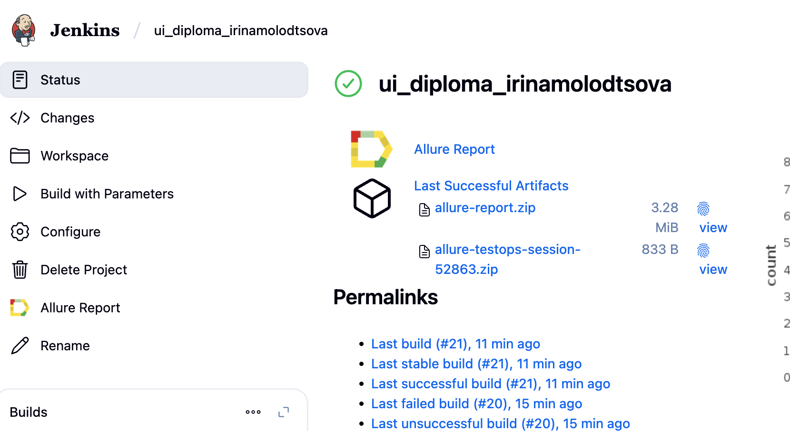
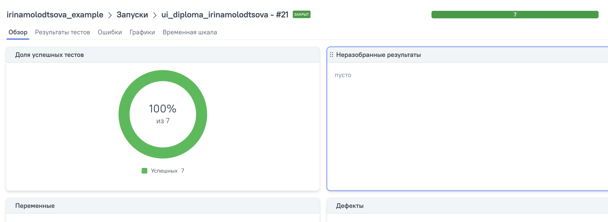
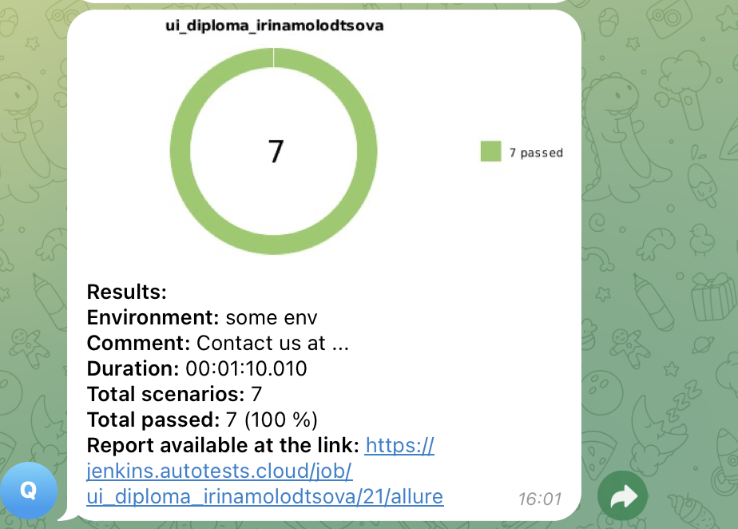
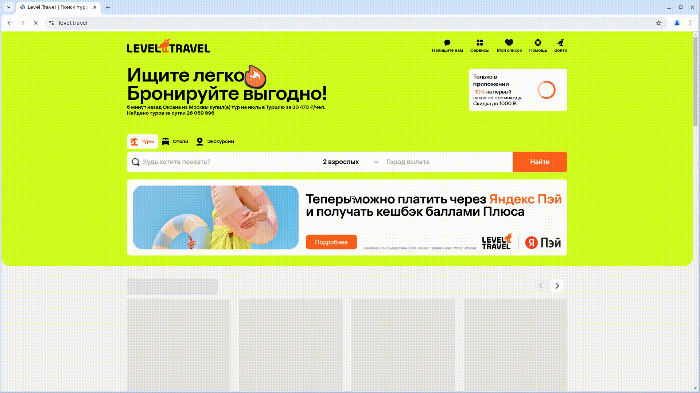

# Проект по автоматизации тестовых сценариев для сайта компании  <a href="https://level.travel/ "> LevelTravel</a></h1>

Написаны тесты на проверку доступного функционала

Негативный тест на поиск тура без выбора даты

Динамический тест на поиск тура по рандомным значениям (библиотека Faker)

## Содержание:

- Используемый стек
- Запуск автотестов
- Сборка в Jenkins
- Пример Allure-отчета
- Интеграция с Allure TestOps
- Интеграция с Jira
- Уведомления в Telegram
- Видео примера запуска тестов в Selenoid

## Используемый стек

Тесты в данном проекте написаны на языке <code>Java</code> с использованием фреймворка для
тестирования [Selenide](https://selenide.org/), сборщик - <code>Gradle</code>. <code>JUnit 5</code> задействован в
качестве фреймворка модульного тестирования.
При прогоне тестов для запуска браузеров используется [Selenoid](https://aerokube.com/selenoid/).
Для удаленного запуска реализована джоба в <code>Jenkins</code> с формированием Allure-отчета и отправкой результатов
в <code>Telegram</code> при помощи бота. Так же реализована интеграция с <code>Allure TestOps</code> и <code>
Jira</code>.

Содержание Allure-отчета:

* Шаги теста;
* Скриншот страницы на последнем шаге;
* Page Source;
* Логи браузерной консоли;
* Видео выполнения автотеста.

## Запуск автотестов

##  Сборка в Jenkins

Для запуска сборки необходимо перейти в раздел <code>Собрать с параметрами</code> и нажать кнопку <code>Собрать</code>.

После выполнения сборки, в блоке <code>История сборок</code> напротив номера сборки появятся значки <code>Allure Report</code> и <code>Allure TestOps</code>, при клике на которые откроется страница с сформированным html-отчетом и тестовой документацией соответственно.

**Для локального запуска используется команда:**

./gradlew clean Test

[Ссылка на JenkinsJob](https://jenkins.autotests.cloud/job/ui_diploma_irinamolodtsova/)

##  Пример Allure-отчета

### Overview

##  Интеграция с Allure TestOps

На *Dashboard* в <code>Allure TestOps</code> видна статистика количества тестов: сколько из них добавлены и проходятся
вручную, сколько автоматизированы. Новые тесты, а так же результаты прогона приходят по интеграции при каждом запуске
сборки.

### Результат выполнения автотеста

##  Интеграция с Jira

Реализована интеграция <code>Allure TestOps</code> с <code>Jira</code>, в тикете отображается, какие тест-кейсы были
написаны в рамках задачи и результат их прогона.

###  Уведомления в Telegram с использованием бота

После завершения сборки специальный бот, созданный в <code>Telegram</code>, автоматически обрабатывает и отправляет
сообщение с отчетом о прогоне тестов.

###  Видео примера запуска тестов в Selenoid

В отчетах Allure для каждого теста прикреплен не только скриншот, но и видео прохождения теста

  

